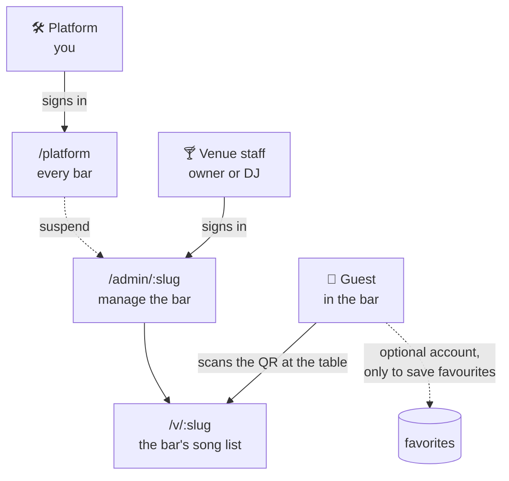
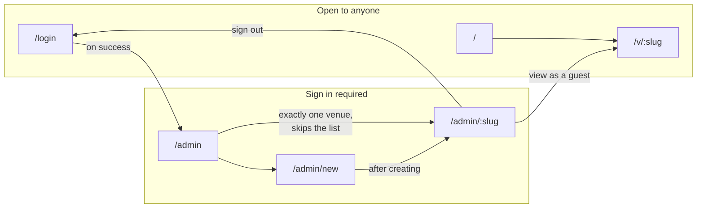
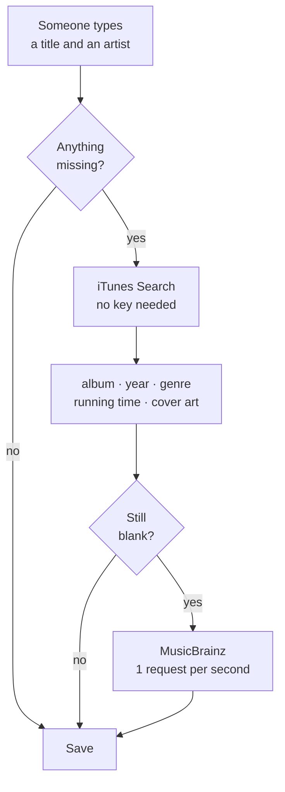
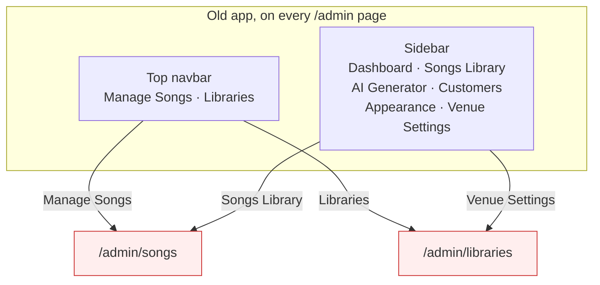

# Karaoke OS — the map

What exists, how it connects, and who may reach it.

Live at **https://karaoke-os.netlify.app**. See [DEPLOY.md](DEPLOY.md).

`/dev/ui` is deliberately absent below. It is a bench for looking at the
staff components without signing in, it 404s in production, and it is not
part of the product.

**This file is checked by CI.** `scripts/check-map.mjs` compares the `routes`
block below against the real page files. Add a page without listing it and the
build fails. So this map cannot quietly go stale.

## 0. Screens at a glance

The whole app as a list. `+` means not built yet.

**Anyone — no account**

* **Home** `/`
  * read what Karaoke OS is
  * go to venue sign in
* **Venue song list** `/v/blue-note`
  * search by song or artist
  * filter by genre
  * show more of a long list
  * see whether karaoke is on tonight
  * tap a song for a card to show the DJ
  * save a favourite *(the one thing an account buys)*
  * show only your favourites
  * switch between light, dark, and the system setting
* **Sign in** `/login`
  * sign in
  * create an account — staff or guest, the same form
  * return to the page you came from

**Venue staff — sign in required**

* **Your venues** `/admin`
  * open a venue
  * *(skipped when you own exactly one)*
* **Add a venue** `/admin/new`
  * name it and claim its web address
* **Import songs** `/admin/blue-note/import`
  * choose a CSV file, or paste rows
  * see what will be imported before it happens
  * skip songs the venue already has
* **Code for the tables** `/admin/blue-note/share`
  * print a card for each table
  * copy the guest link
  * download the code as PNG or SVG
* **Songs** `/admin/blue-note`
  * see how many songs, how many are missing details, how many were added
    this week, and how many genres
  * search the catalogue and add the real record
  * type a song in by hand when the catalogue does not have it
  * match a song already in the list to a catalogue record
  * edit a song
  * remove a song
  * remove several songs at once
  * search by title or artist
  * filter by genre
  * filter by whether a song is missing details
  * sort by title, artist, genre or year
  * page through a long list
  * fill in missing song details
  * + manage several song lists
* **The rail** *(the one menu, on every staff screen)*
  * open or close karaoke, beside the lamp that shows whether it is on
  * go to Songs, Import a CSV or the QR code
  * open the guest page in a new tab
  * go to your other venue, or add one
  * switch between light, dark, and the system setting
    *(the rail follows the theme)*
  * sign out

**You — platform**

A separate system, not an area of the venue app. Its own door, its own
account, its own rail. No venue screen links here, and nothing here links
into a venue. An operator is not staff at any bar.

* **Operator sign in** `/platform/login`
  * sign in as an operator
  * *(no sign-up — an operator account is granted, not claimed)*

* **All venues** `/platform`
  * see every venue, its owner and its size
  * see which bars have karaoke on right now
  * suspend a venue, which hides it from guests
  * restore a suspended venue

---

## 1. The three tiers



A guest needs no account. Staff need one. You are a staff account with
`is_platform_admin` set — see [SCHEMA.md](SCHEMA.md).

---

## 2. Sitemap



Every route that exists. CI checks this list.

```routes
/
/login
/admin
/admin/new
/admin/[slug]
/admin/[slug]/import
/admin/[slug]/share
/platform
/platform/login
/v/[slug]
```

| Route | Who | What it does |
|---|---|---|
| `/` | anyone | Landing page. Says what this is, and sends staff to sign in. |
| `/v/[slug]` | anyone | The song list a guest browses. No login. |
| `/login` | anyone | Sign in or create a staff account. |
| `/admin` | staff | Your venues. Skips straight through if you have one. |
| `/admin/new` | staff | Create a venue and become its owner. |
| `/admin/[slug]` | staff of that venue | Songs, and open or close karaoke. |
| `/admin/[slug]/import` | staff of that venue | Load a CSV of songs, with a preview first. |
| `/admin/[slug]/share` | staff of that venue | The QR code and link guests use. Printable. |
| `/platform` | platform staff only | Every venue, with the power to suspend one. |

---

## 3. Data model

```mermaid
erDiagram
    venues ||--o{ libraries : "has"
    venues ||--o{ memberships : "is staffed by"
    venues ||--o{ sessions : "runs"
    users ||--o{ memberships : "works at"
    users ||--o{ favorites : "saves"
    libraries ||--o{ songs : "holds"
    songs ||--o{ favorites : "is saved as"

    venues { uuid id PK; text name; text slug UK }
    users { uuid id PK; text email UK; bool is_platform_admin }
    memberships { uuid user_id FK; uuid venue_id FK; text role }
    libraries { uuid id PK; uuid venue_id FK; bool is_public }
    songs { uuid id PK; uuid library_id FK; text title; text artist }
    sessions { uuid id PK; uuid venue_id FK; timestamptz closed_at }
    favorites { uuid user_id FK; uuid song_id FK }
```

A guest has no row anywhere. A patron with favourites is a `users` row with no
`memberships` row. That absence is the whole definition.

---

## 4. Where song details come from



**Why iTunes leads.** MusicBrainz indexes every recording that exists. Asked
for "Bohemian Rhapsody" by Queen it returns ten live bootlegs and no studio
track, so taking the first hit gave the album *Live USA* and the year 1991.
iTunes indexes the commercial catalogue and returned 1975 and 5:55. Checked
against five standards, iTunes got the year and running time right on all five.

Anything a person typed is never overwritten.

---

## 5. What is built

| Feature | State |
|---|---|
| Guest song list, search | built |
| Guest genre filter | built |
| Card a guest shows the DJ | built |
| Guest sees whether karaoke is on | built |
| Staff sign in and sign out | built |
| Create a venue | built |
| Add and remove songs | built |
| Fill in song details automatically | built |
| Pick a song from the catalogue | built |
| Open and close a karaoke session | built |
| One venue cannot touch another | built, tested |
| Edit a song | built |
| Song table: search, sort, pages, bulk delete | built |
| CSV import | built |
| QR code and share link | built |
| Several libraries per venue | **to port** |
| Dark mode | built |
| Favourites for guests | built |
| Song requests to the DJ | schema sketched, not built |
| Platform tier | built |
| Playback | out of scope, needs karaoke hardware |

---

## 6. Navigation problems

### What went wrong before

The old app ran two navigations at once, and they disagreed.



Five faults, all confirmed in the code:

1. **Two menus, same destinations.** The navbar rendered on admin pages too, so
   `/admin/songs` was reachable from "Manage Songs" and from "Songs Library".
2. **One page, two names.** `/admin/libraries` was "Libraries" at the top and
   "Venue Settings" in the sidebar. This is the thing you noticed.
3. **Four of six sidebar items were empty.** Dashboard, AI Generator, Customers
   and Appearance all rendered "Coming Soon".
4. **"Home" meant two places.** The navbar logo went to `/`. The sidebar brand
   went to `/admin/songs`.
5. **Guest and staff shared one navbar.** A signed-in visitor browsing the
   guest page still saw staff links.

### The rule from now on

**One surface, one menu.** The guest pages and the staff pages do not share
navigation. A page has exactly one route and exactly one name, used everywhere.
Nothing appears in a menu before the page behind it works.

### Faults found and fixed

Both were in the first build of these screens, and both are corrected.

| Problem | Fix |
|---|---|
| `/` listed every venue, publishing the customer list to anyone. A guest arrives by QR code and never needs it. | `/` is a landing page. No venue is named on it. |
| Owning exactly one venue made `/admin` skip the venue list, leaving "Add a venue" unreachable without typing the URL. | "Add a venue" sits in the rail, on every staff screen. |
| The rail's way back was called "Your venues", which for a single-venue owner was a list of one — so **Add a venue** was a dead end for exactly the people most likely to open it. | With one venue the rail names that venue instead. With several it says "Your venues". |

### Still open

- No venue switcher in the rail. Running two bars means going back to
  **Your venues**. Worth doing when someone actually runs two.
